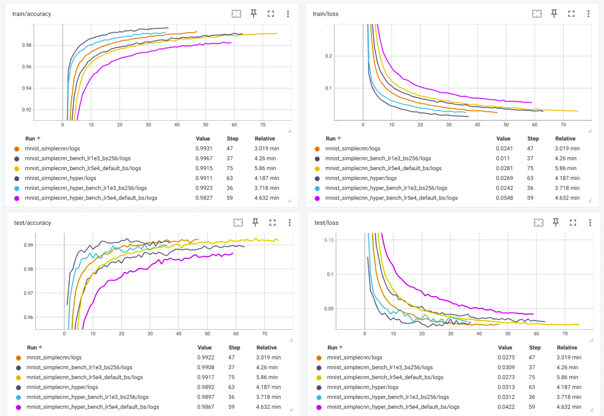
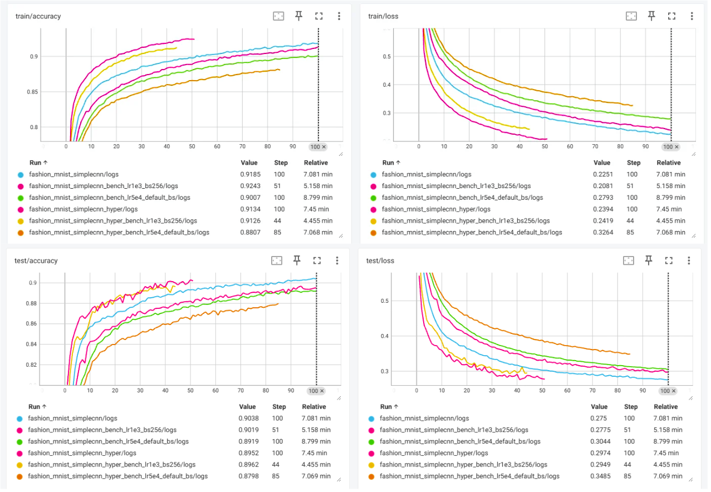

# HyperNetworks

[](#part-1--static-hypernetworks-tensorflow-vision)
[](#part-2--hyperlstm-demo-pytorch-char-level)

This repository studies **hypernetworks** along two complementary lines:

1. **Static hypernetworks (TensorFlow 2)** — convolution layers whose kernels are generated from learned embeddings for small-scale image classification.
2. **Dynamic hypernetworks (PyTorch)** — a classroom-ready **HyperLSTM** demo (Ha et al., Appendix A.2.2) for character-level sequence modeling, compared to a vanilla LSTM.

The two tracks use **different stacks** (TensorFlow vs PyTorch). Install and run the part you need using the sections below.

<p align="center">
  
  
</p>
<p align="center">
  <i>Static hypernetwork idea: generate convolution kernels from learned embeddings.</i>
</p>

## Contents

- [Part 1 — Static hypernetworks (TensorFlow, vision)](#part-1--static-hypernetworks-tensorflow-vision)
  - [Static hypernetwork visuals](#static-hypernetwork-visuals)
  - [Installation (TensorFlow)](#installation-tensorflow)
  - [Datasets (vision)](#datasets-vision)
  - [Vision models](#vision-models)
  - [Running experiments (TensorFlow)](#running-experiments-tensorflow)
  - [Checkpoints and evaluation (TensorFlow)](#checkpoints-and-evaluation-tensorflow)
- [Part 2 — HyperLSTM demo (PyTorch, char-level)](#part-2--hyperlstm-demo-pytorch-char-level)
  - [Installation (PyTorch)](#installation-pytorch)
  - [Quick start (PyTorch)](#quick-start-pytorch)
  - [Output artifacts (PyTorch)](#output-artifacts-pytorch)
- [Repository layout (overview)](#repository-layout-overview)

---

## Part 1 — Static hypernetworks (TensorFlow, vision)

TensorFlow 2 code for **static hypernetworks** in image classification: baseline CNN / ResNet-style models, hypernetwork-based convolutions, a custom training loop, and controlled experiments on compact vision datasets.

### Static hypernetwork visuals

Quick visuals from the repo’s experiments and notes:

<p align="center">
  
</p>
<p align="center">
  <i>Hyperparameter Tuning on MNIST: Baseline vs. Hypernetwork</i>
</p>

<p align="center">
  
</p>
<p align="center">
  <i>Hyperparameter Tuning on Fashion-MNIST: Baseline vs. Hypernetwork</i>
</p>

### What this part covers

- Standard convolutions and hypernetwork-generated convolutions
- A lightweight `SimpleCNN` baseline
- A ResNet-v2 style `resnet50`
- A CIFAR-style `wrn40_2` (WideResNet-40-2) with `BasicBlock`
- Training, validation, checkpointing, TensorBoard logging, and test evaluation
- Reporting from the **best validation checkpoint**

### Installation (TensorFlow)

```powershell
python -m venv venv
.\venv\Scripts\activate
python -m pip install --upgrade pip
pip install -r requirements.txt
```

`requirements.txt` pins: `tensorflow==2.15.0`, `numpy==1.26.4`, `matplotlib==3.8.4`, `tensorboard==2.15.1`, `scipy`.

### Datasets (vision)

Supported datasets:

- `mnist`, `fashion_mnist`, `cifar10` — via `tf.keras.datasets`
- `svhn` — `.mat` files under `../data/svhn` by default (`train_32x32.mat`, `test_32x32.mat`)

Loaders live in `my_datasets/`. Labels are one-hot; images are normalized to `[0, 1]`.

### Vision models

| Model | Summary |
|--------|---------|
| `simplecnn` | Two conv layers (the second can be `HyperConv2D`), pooling, dense head; grayscale `28×28×1` or RGB `32×32×3` |
| `resnet50` | Subclassed ResNet-v2 with `BottleneckBlock` |
| `wrn40_2` | WideResNet-40-2: 3×3 stem, 16 channels, 3 stages, 6 `BasicBlock`s per stage, widths 32→64→128 |

Hypernetwork pieces are in `model/utils.py`: `HyperConv2D`, `SharedHyperConvMLP`. With `hyper_mode=True`, selected layers use hyper-convolutions instead of plain `Conv2D`.

### Running experiments (TensorFlow)

**Notebook:** open `static_hypernetwork.ipynb`.

**Or use `Solver`:**

```python
from pathlib import Path

from solve.static_hypernet import Solver


def build_run_paths(dataset, model, hyper_mode=False):
    run_name = f"{dataset}_{model}"
    if hyper_mode:
        run_name += "_hyper"
    run_root = Path("runs") / run_name
    return {
        "logpath": str(run_root / "logs"),
        "save_dir": str(run_root / "checkpoints"),
    }


run_paths = build_run_paths("cifar10", "wrn40_2", hyper_mode=True)

solver = Solver(
    dataset="cifar10",
    model="wrn40_2",
    max_epoch=20,
    hyper_mode=True,
    logpath=run_paths["logpath"],
    save_dir=run_paths["save_dir"],
    show_sample=False,
    show_filters=False,
)
solver.train()
```

Main `Solver` arguments (`solve/static_hypernet.py`): `dataset` (`mnist` \| `fashion_mnist` \| `cifar10` \| `svhn`), `model` (`simplecnn` \| `resnet50` \| `wrn40_2`), `max_epoch`, `hyper_mode`, `logpath`, `save_dir`, `val_split` (default `0.1`), `resume`, `eval_only`, `show_sample`, `show_filters`, `run_final_test_from_best`.

Useful defaults: batch size `1024`, Adam, initial LR `5e-4`, exponential decay `0.99`, global gradient clip norm `100.0`, seed `42`.

**TensorBoard:**

```powershell
tensorboard --logdir runs
```

Then open [http://localhost:6006](http://localhost:6006).

### Checkpoints and evaluation (TensorFlow)

Under `save_dir`: `latest/`, `best/`, `history/`, `training_state.json`. After training, the solver can reload the **best validation** checkpoint and report test metrics. `REFERENCE_TEST_METRICS` includes a small reference table (e.g. CIFAR-10 + WRN-40-2 baseline); exact matching depends on augmentation, splits, schedules, etc.

**Practical notes:** Keras may show `Output Shape: multiple` for subclassed models; TF 2.15 can emit internal deprecation warnings; SVHN needs local `.mat` files; `wrn40_2` is the natural CIFAR-style choice over `resnet50` for many setups.

**Suggested starting points:** `simplecnn` on `mnist` for a quick sanity check; `wrn40_2` on `cifar10` for main experiments; compare `hyper_mode=False` vs `True` under identical settings.

---

## Part 2 — HyperLSTM demo (PyTorch, char-level)

PyTorch demo of [*HyperNetworks*](https://arxiv.org/abs/1609.09106), focused on the **HyperLSTM** dynamic hypernetwork (Appendix A.2.2). Train, compare to LSTM, save checkpoints and logs, generate text samples, and run a polished CLI demo.

### Layout (PyTorch demo)

| Path | Role |
|------|------|
| `dynamic_hypernetwork/hyperlstm.py` | `HyperLSTMCell` and `HyperLSTM` |
| `dynamic_hypernetwork/models.py` | Character-level `LSTM` and `HyperLSTM` with one interface |
| `dynamic_hypernetwork/data.py` | Built-in corpus loader and optional Tiny Shakespeare download |
| `dynamic_hypernetwork/training.py` | Training loop, evaluation, checkpoint I/O, sampling |
| `run_char_experiment.py` | CLI for training and generation |
| `compare_models.py` | Side-by-side LSTM vs HyperLSTM |
| `demo_commands.sh` | Canned commands for live demo |
| `BAO_CAO_DEMO_VI.md` | Vietnamese write-up you can adapt for submission |

**Paper alignment:** HyperLSTM follows the efficient modulation idea in Eq. (10)–(13): a smaller hyper LSTM reads `[h_{t-1}, x_t]`, produces embeddings `z`, and generates scaling (and dynamic biases) for the main LSTM’s projections so effective weights vary in time **without** materializing a full new weight matrix every step.

### Installation (PyTorch)

**Conda (recommended for the demo):**

```bash
conda env create -f environment.yml
conda activate hypernetwork-demo
```

**pip only** (use a **separate** virtualenv; do not use the TensorFlow `requirements.txt` for this track):

```bash
python -m venv venv-pt
# Windows: .\venv-pt\Scripts\activate
pip install "torch>=1.12"
```

### Quick start (PyTorch)

Train HyperLSTM quickly on the built-in corpus:

```bash
python run_char_experiment.py train \
  --model hyperlstm \
  --device cpu \
  --output-dir artifacts/hyperlstm_quick_demo \
  --steps 120 \
  --eval-every 30 \
  --sample-every 60
```

Compare on Tiny Shakespeare:

```bash
python compare_models.py \
  --download-tinyshakespeare \
  --device cpu \
  --output-dir artifacts/shakespeare_comparison \
  --steps 300 \
  --eval-every 50 \
  --sample-every 150 \
  --prompt "ROMEO:"
```

Generate from the best checkpoint:

```bash
python run_char_experiment.py generate \
  --checkpoint artifacts/shakespeare_comparison/hyperlstm/best.pt \
  --device cpu \
  --prompt "ROMEO:" \
  --length 400
```

### Output artifacts (PyTorch)

Each run can save: `config.json`, `history.jsonl`, `best.pt`, `last.pt`, `summary.json`, `final_sample.txt`, `samples/sample_step_*.txt`.

**Suggested submission flow:** run `compare_models.py` → open `artifacts/.../comparison.md` → show samples from both models → use `BAO_CAO_DEMO_VI.md` as the written explanation.

**Notes:** Educational PyTorch code, faithful to the HyperLSTM idea but not a line-by-line port of the original research code. For stronger results, use a larger corpus and increase `steps`, `hidden-size`, and `hyper-hidden-size`.

---

## Repository layout (overview)

```text
HyperNetworks/
├── dynamic_hypernetwork/     # PyTorch: HyperLSTM demo
├── model/                    # TensorFlow: CNN / ResNet / utils
├── my_datasets/              # TensorFlow: loaders
├── solve/
│   └── static_hypernet.py    # TensorFlow: Solver
├── utils/
├── static_hypernetwork.ipynb
├── run_char_experiment.py
├── compare_models.py
├── demo_commands.sh
├── environment.yml           # Conda env for PyTorch demo
├── requirements.txt          # pip deps for TensorFlow vision
└── BAO_CAO_DEMO_VI.md
```